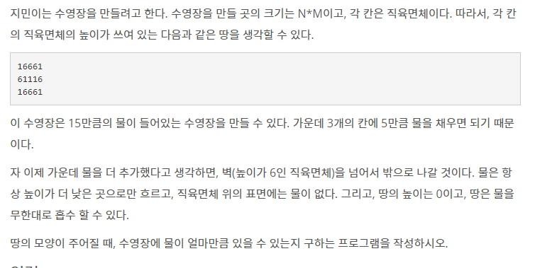

# [BOJ]_1113_수영장만들기

### 문제



### 입력

첫째 줄에 N과 M이 주어진다. N과 M은 50보다 작거나 같은 자연수이다. 둘째 줄부터 N개의 줄에 땅의 높이가 주어진다. 높이는 1보다 크거나 같고, 9보다 작거나 같은 자연수이다.

### 출력

첫째 줄에 문제의 정답을 출력한다.

### 풀이

- 입력받은 수영장을 3차원배열로 그려낸다
- 각 층에서 시작점을 선택하여 시작점부터 bfs로 확인하여 맵의 밖으로 이동하는 길이 존재하는 경우 수영장 크기에 추가하지 않는다.
- 방문한 점을 층마다 새로 저장하여 가지치기 해준다.
- 밖으로 나가는 경로가 있더라도 해당 점과 이어진 곳을 모두 체크해준다.


```python
import sys
from collections import deque


# N, M입력
N, M = map(int, sys.stdin.readline().rstrip().split())
#수영장 입력받기
MAP_in = [sys.stdin.readline().rstrip()for _ in range(N)]
#수영장 벽의 최대높이 저장 위한 변수
TOP = 0
#수영장의 부피 저장하기 위한 변수
result = 0
#상하좌우 
dx = [-1, 1, 0, 0]
dy = [0, 0, -1, 1]

#1. 수영장 벽의 최대높이를 측정하자 : 최대 10까지 입력을 받을 수 있으나 3차원 배열을 사용하므로 가지치기 용 높이 측정이다.
for x in range(N):
    for y in range(M):
        TOP = max(TOP, int(MAP_in[x][y]))
#2-1. 3차원 수영장 건설하기 2차원 => 3차원
#가로 M 세로 N 높이 TOP만큼 맵을 기초공사 해준다
MAP = [[[0] * M for _ in range(N)] for _ in range(TOP)]
#2-2 벽쌓기
#세로
for x in range(N):
    #가로
    for y in range(M):
        #높이
        for z in range(int(MAP_in[x][y])):
           #벽을 만든다
            MAP[z][x][y] = 1
#BFS에 사용할 스택
q = deque()
#3. 벽 높이마다 물을 가둬두는지 확인하기
for z in range(TOP):
    # BFS를 사용하면서 중복 방문하지 않도록 2차원 배열을 만들어둔다
    visited = [[0] * M for _ in range(N)]
    # 가장자리는 조사해도 밖으로 물이 흐르므로 가장자리를 제외하고 시작점을 시작한다
    for x in range(1,N-1):
        for y in range(1, M-1):
            #한 층의 모든 점을 시작점으로 생각한다.
            cnt = 0
            # 현재점이 방문하지 않았고 벽이 아니라면 시작점으로 넣어주자
            if visited[x][y] == 0 and MAP[z][x][y] == 0:
                #방문했다고 체크
                visited[x][y] = 1
                #물 공간 1추가
                cnt += 1
                #스택에 넣어준다
                q.append((x, y))
            #밖으로 이어져 있는지 확인하는 변수
            put = True
            #시작점이 세팅되었다면
            while len(q) > 0:
                #시작점 넣기
                now = q.popleft()
                nowx = now[0]
                nowy = now[1]
                #상하좌우 체크해보자
                for add in range(4):
                    nx = nowx + dx[add]
                    ny = nowy + dy[add]
                    # 다음점이 맵밖이라면 
                    if 0 > nx or N <= nx or  0 > ny or M <= ny:
                        #물이 빠져나갔으니 공간으로 추가하지말자
                        put = False
                        #다른 점도 체크해주자
                        continue
                    #맵 안이지만 방문을 했었거나 벽이라면
                    if visited[nx][ny] == 1 or MAP[z][nx][ny] == 1:
                        #다른점 체크로 가자
                        continue
                     #위의 조건을 거쳐서 왔다는 것은 벽이아니고 맵밖이 아니라는 뜻이므로 공간을 1 추가해준다. 단! 이번 시작점과 맵의 밖이 연결되어있다면 PUT변수로 저장해놓았다
                    cnt += 1
                    #방문했다고 체크
                    visited[nx][ny] = 1
                    #다음점으로 세팅
                    q.append((nx,ny))
            #시작점과 이어진 공간들을 모두 조사하였을 때 맵밖으로 연결되어있지 않다면 물이 고여있다고 생각할 수 있으므로 결과값에 저장시켜주자.
            if put:
                result += cnt

print(result)
```


