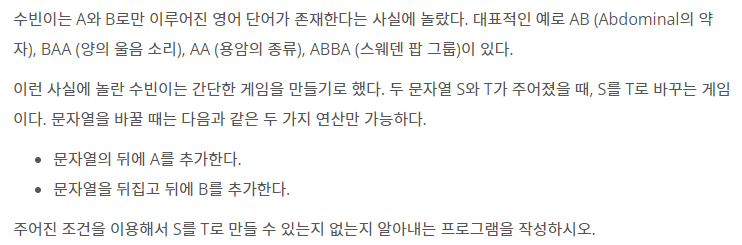

# [BOJ]_12904_A와B

### 문제



### 입력

첫째 줄에 S가 둘째 줄에 T가 주어진다. (1 ≤ S의 길이 ≤ 999, 2 ≤ T의 길이 ≤ 1000, S의 길이 < T의 길이)

### 출력

S를 T로 바꿀 수 있으면 1을 없으면 0을 출력한다.

### 풀이

- 길이 두가지 방식인 DFS와 BFS로 생각해볼 수 있다.
- 하지만 위의 방식은 알고리즘에 길들여진 생각.
- 단순하게 모든 경우의 수를 찾는것이 아닌 정답으로 만들어야 할 문자를 변경해서 하면 더 빠르다

```python
import sys

#시작 문자열
st_str = sys.stdin.readline().rstrip()
#완성 문자열
end_str = sys.stdin.readline().rstrip()
result = 0

#시작문자열 길이보다 완성문자열 길이가 길때까지.
while len(end_str) >= len(st_str):
    #두 문자열이 같니? 그럼 그만해
    if end_str == st_str:
        result = 1
        break
    else:
        #완성 문자열의 맨뒤가 A라면 
        if end_str[-1] == 'A':
            #맨뒤를 때서 저장해
            end_str = end_str[:-1]
      	#완성 문자열의 맨뒤가 B라면
        elif end_str[-1] == 'B':
            #맨뒤를 때서 저장하고
            end_str = end_str[:-1]
            tmp = ''
            #뒤집자~!
            for x in range(len(end_str)-1 ,-1, -1):
                tmp += end_str[x]
            #뒤집어서 저장하자.
            end_str = tmp
        #한번 확인마다 완성 문자열 길이가 하나씩 줄어간다.
        # 두 문자열의 길이가 같아졌을때 까지 반복.
            
print(result)
```


