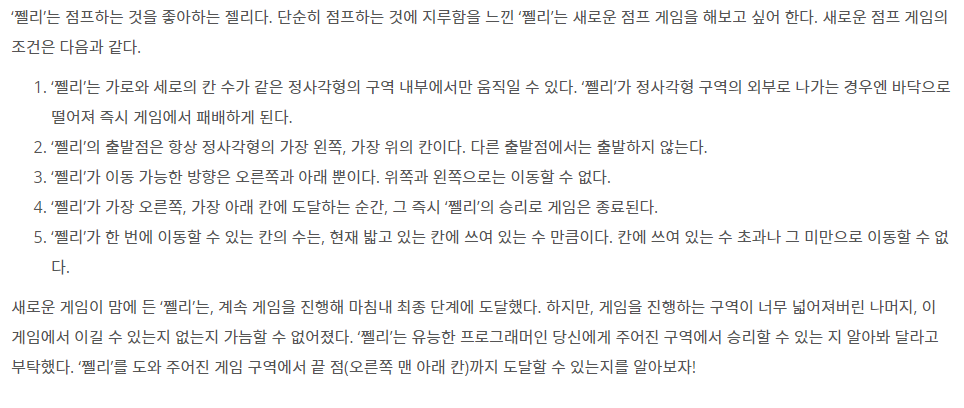
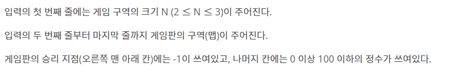
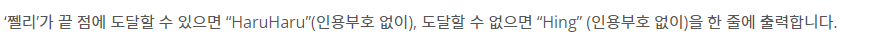

# [BOJ]16173_점프왕쩰리

### 문제




### 입력




### 출력




### 풀이

- 흔한 제한된 맵 속에서 이동하며 완전 탐색하는 문제이다.
- 오른쪽, 아랫쪽으로만 이동할 수 있으므로 방문한 곳을 체크할 필요는 없다. 다만 방문했던 곳을 재방문하여 탐색하는 경우가 생길 수 있으므로 가지치기의 일환으로 체크해준다.
- 맵의 최하단 맨 오른쪽에 도착할 경우를 생각할때 인덱스 값으로 확인하는 경우와 -1의 검출로 확인 하는 경우를 생각하는데 어셈블리어, 기계어 측면에서 인덱스로 확인하는 것이 조금더 빠르지 않을까 생각하여 인덱스로 확인한다.
- 현재 방문한 맵의 좌표에서 점프하는 값을 가져와서 가려고 하는 방향으로 곱연산을 하여 다음 갈 곳을 정한다.
- 도착점에 방문 할 수 있는 한가지 방법만을 찾으면 되므로 출력값이 처음 hing으로 설정하여 도착했을 때  haruharu로 변경해 주며 이를 기저조건으로 하여 가지치기 해준다.
- 재귀의 깊이를 늘려주어야 한다.

```python
import sys
#재귀 늘리기
sys.setrecursionlimit(100000)
#동, 남
dx = [0, 1]
dy = [1, 0]
def dfs(nowx, nowy):
    global result
    # 도착한 것을 찾았다면 끝내!
    if result == 'HaruHaru':
        return
	# 끝점에 도착했니? 그럼 알려주고 끝내!
    if MAP[nowx][nowy] == -1:
        result = 'HaruHaru'
        return 
	#동, 남으로 이동하므로 두가지경우만 하자
    for x in range(2):
        # 다음좌표로 이동시 점프할 거리 확인하자
        nx = nowx + dx[x] * MAP[nowx][nowy]
        ny = nowy + dy[x] * MAP[nowx][nowy]
        # 맵을 벗어나면 하지말자...
        if 0 <= nx < N and 0 <= ny < N:
            #방문했던 곳이라면 하지말고 방문 안했으면 가보자!
            if visited[nx][ny] == 0:
                visited[nx][ny] = 1
                dfs(nx,ny)
                


N = int(sys.stdin.readline())
MAP = [list(map(int, sys.stdin.readline().split()))for _ in range(N)]
# 방문한 맵 만들기
visited = [[0] * N for _ in range (N)]
result = 'Hing'
#시작점 방문 표시.
visited[0][0] = 1
dfs(0,0)
print(result)
```


### 코멘트

- 솔직히 조금 쉬운 문제였다. 다만 재귀를 늘려야 하는점. 가지치기를 어떻게 할 것인가에 관하여 생각해볼 수 있는 계기가 되었다.
