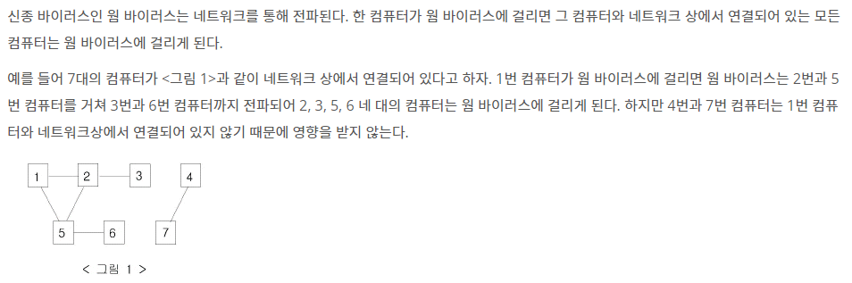
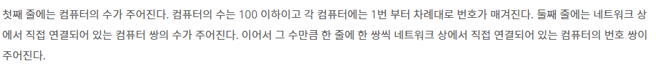
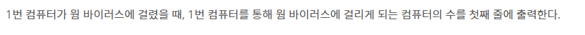

# [BOJ]_2606_바이러스

### 문제



### 입력



### 출력



### 풀이

- 인접행렬로 접근하여도 괜찮지만 리스트로 만들어서 접근하는 것이 속도와 메모리 측면에서 더 좋다.
- 양방향 노드이므로 두 인덱스에서 추가해준다
- 큐로 접근하며 한번 접근한 노드를 체크하여 재방문 하지 않도록 한다.
- 처음 1번 컴퓨터는 바이러스 카운트에서 제외한다.

```python
import sys
# 큐로 설정하기위한 임포트
from collections import deque

N = int(sys.stdin.readline())
#노드를 설정하기 위한 빈 리스트
com_line = [[] for _ in range(N + 1)]
for _ in range(int(sys.stdin.readline())):
    #양방향 노드이므로 노드 두곳에서 추가해준다
    node1, node2 = map(int, sys.stdin.readline().split())
    com_line[node1].append(node2)
    com_line[node2].append(node1)
#방문자 체크 리스트를 만든다
hacked = [0] * (N + 1)
#큐 선언
q = deque()
#1번 컴퓨터 입력
q.append(1)
#확인해볼 컴퓨터가 있다면
while q:
    #확인할 컴퓨터 반환
    now_node = q.popleft()
    #방문했다고 처리
    hacked[now_node] = 1
    # 현재 컴퓨터와 연결 되어있는 컴퓨터 확인
    for x in com_line[now_node]:
        #연결된 컴퓨터가 방문 하지 않았었다면
        if hacked[x] == 0:
            #방문해볼 컴퓨터 리스트로 추가해준다
            q.append(x)
# 방문해왔던 컴퓨터들 종합해보자
result = sum(hacked)
# 1번 컴퓨터 제외하고 출력
print(result -1)
```
