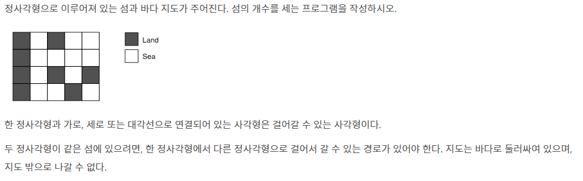
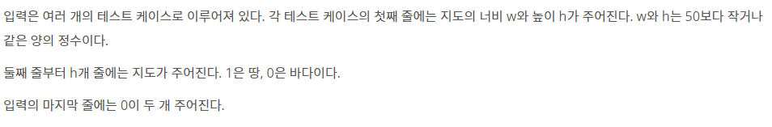

# [BOJ]_4963_섬의개수

### 문제



### 입력



### 출력


### 풀이

- 가로, 세로, 대각선  즉 8방향으로 확인해봐야 한다.
- 방문한 곳을 체크하여 재방문 하지 않아야한다.
- 맵이 1일때만 가야한다
- 한번 발 딛은 섬을 카운트하고 이 섬을 모두 체킹한다.

```python
import sys
#재귀 제한 풀기
sys.setrecursionlimit(100000)
# 상 하 좌 우 대각선
dx = [-1, 1, 0, 0, 1, 1, -1, -1]
dy = [0, 0, -1, 1, 1, -1, -1, 1]
def dfs(nowx, nowy):
    #기저조건 없음..
    for x in range(8):
        nx = nowx + dx[x]
        ny = nowy + dy[x]
        #맵 밖으로 나가는지 체크
        if 0 <= nx < H and 0 <= ny < W:
            #방문하지 않았으면 진행
            if visited[nx][ny] == 0:
                #육지니?
                if MAP[nx][ny] == 1:
                    #방문표시하기
                    visited[nx][ny] = 1
                    #방문하기
                    dfs(nx, ny)


while True:
    W, H = map(int, sys.stdin.readline().split())
    # w와 h가 0, 0일때까지 진행
    if W == 0 and H == 0:
        break
       #맵 입력
    MAP = [list(map(int, sys.stdin.readline().split()))for _ in range(H)]
    # 방문 맵 생성
    visited = [[0] * W for _ in range(H)]
    #섬의 갯수 카운트 변수
    result = 0
    #좌표 하나하나 들어가보기
    for x in range(H):
        for y in range(W):
            # 지금 좌표가 방문하지않고 육지라면 가보자
            if visited[x][y] == 0 and MAP[x][y] == 1:
                # 방문했다고 체크하자
                visited[x][y] = 1
                #섬에 한번 상륙하면 카운팅
                result += 1
                #섬의 크기 체크하자
                dfs(x, y)

    print(result)
```

