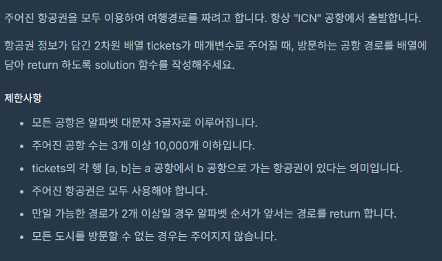
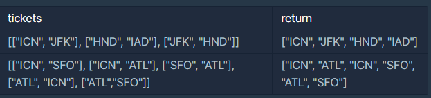

# [PROG]_여행경로

### 문제



### 입출력




### 풀이

- 모든 노드가 연결되있다는 점 유의
- 가능한 경로가 알파벳 순서인 점 유의
- 모든 항공권 사용해야함
- 1. 입력받은 리스트를 도착지 순으로 정렬한다. (정렬 하므로써 그리디 알고리즘이 된다. 즉 처음 간 경로가 알파벳 순서 조건을 만족한다는 점.)
  2. dfs탐색을 한다
  3. 입력받은 리스트의 모든 것을 사용하면 출력한다.

```python
#리스트 입력
def solution(tickets):
    answer = []
    # 1-1 새로 정렬할 리스트 생성
    tick = []
    # 해당 티켓을 사용했니?
    used = [0] * len(tickets)
    # 1-2 도착지를 기준으로 정렬하기 위해 출발지와 도착지가 바뀐 리스트 생성
    for start ,end in tickets:
        tick.append([end, start])
    # 1-3 티켓 정렬
    tick.sort()
	
    # 2 dfs 생성  (현재 여행지, 경로리스트, 길이)
    def dfs(now, visit, result):
        #통과한 경로가 있으면 그만하고 리턴! 왜냐 처음 찾은게 정답이니까.
        if len(result) != 0:
            return result
        
        # 모든 티겟 사용했니?
        if 0 not in used:
            return visit
        
        # 2-1 티켓을 돌면서
        for x in range(K):
            # 2-2 현재 티켓이 사용되지 않다면 실행
            if used[x] == 0:
                # 현재 여행지에서 출발 하는 티켓이니?
                if tick[x][1] == now:
                    #사용 했다
                    used[x] = 1
                    # 가서 리턴받자!
                    result = dfs(tick[x][0], visit + [tick[x][0]], result)
                    # 혹시나 
                    used[x] = 0
        return result
                    
    answer = dfs('ICN', ['ICN'], [])
    
    return answer
```

